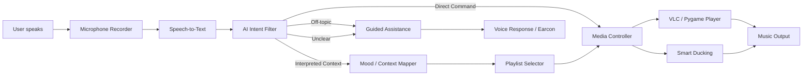
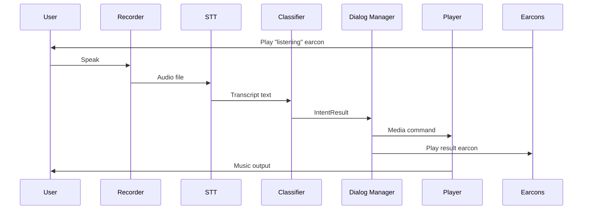

# System Diagram

## Architecture Overview

## Component Responsibilities

| Component | Module | Responsibility |
|---|---|---|
| Microphone Recorder | `audio/recorder.py` | Records short user speech clips, detects silence timeout |
| Speech-to-Text | `speech/openai_stt.py` | Converts audio to text via OpenAI API |
| AI Intent Filter | `ai/intent_classifier.py` | Classifies intent: direct command, context request, help, unclear, off-topic |
| Mood / Context Mapper | `ai/context_mapper.py` | Maps interpreted context to playlist category |
| Playlist Selector | `media/playlist_manager.py` | Chooses local music files from categorized folders |
| Media Controller | `interaction/dialog_manager.py` | Play, pause, stop, next, previous, volume, smart ducking |
| Guided Assistance | `interaction/guided_help.py` | Gives clear accessible responses and examples |
| Earcon Manager | `audio/earcons.py` | Plays audio cues: listening, success, error, mood, help |
| Smart Ducking | `audio/ducking.py` | Reduces volume during speech, fades back smoothly |
| Logger | `logging_utils/interaction_logger.py` | Saves transcripts, results, actions for documentation |

## Data Flow

