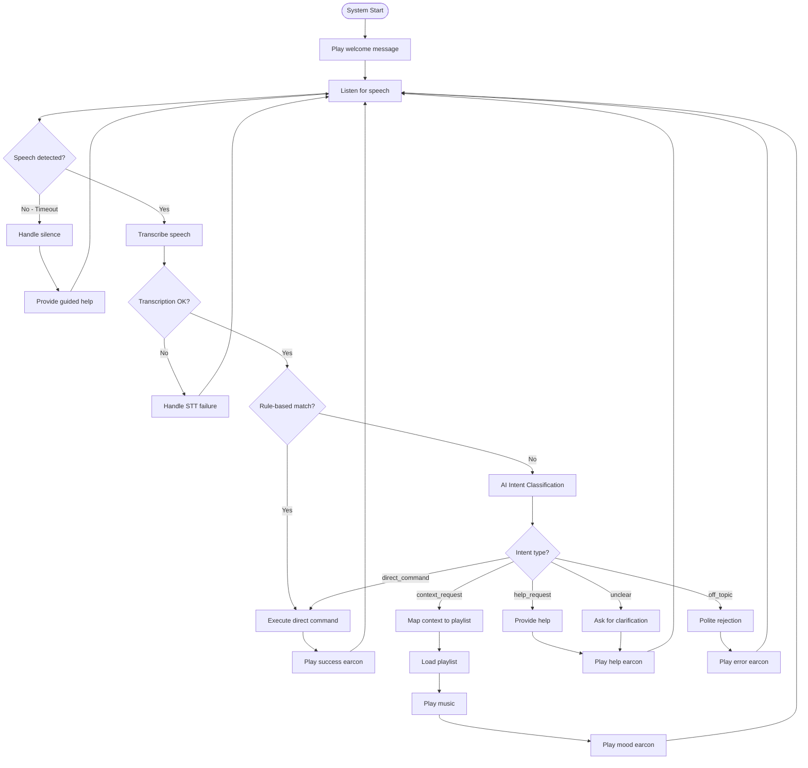
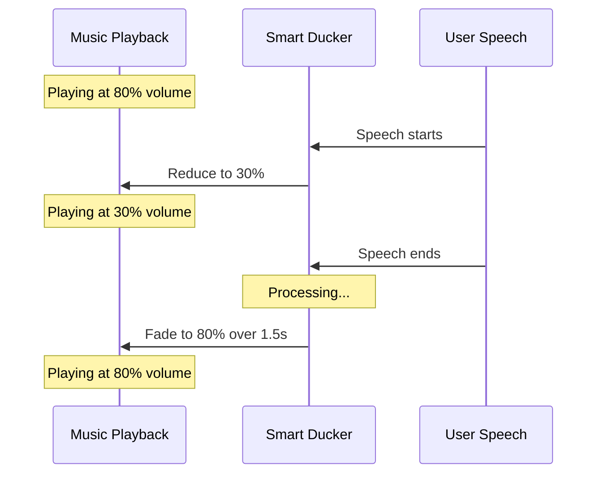

# Interaction Flow

## Main Interaction Flow Diagram

## Decision Points

### 1. Direct Command?
- **Input matches rule-based pattern** → Execute immediately (fast path)
- **Input does not match** → Send to AI classifier

### 2. Context Request?
- **AI identifies mood/context** → Map to music category → Load playlist
- **Unknown context** → Use fallback playlist

### 3. Help Request?
- **Explicit help request** → Provide progressive help
- **First time** → General overview
- **Repeated** → More specific commands and moods

### 4. Off-Topic?
- **Non-music question** → Polite rejection with examples
- **Alternate gentle/firm** → Prevent frustration

### 5. Low Confidence?
- **AI confidence < 0.6** → Override to 'unclear' → Ask clarification
- **Safety filter catches** → Prevents wrong actions

### 6. Silence?
- **No speech for 10 seconds** → Progressive guidance
- **First silence** → Basic help
- **Repeated silence** → More detailed help
- **User takes time** → Patient encouragement

## Smart Ducking Flow

